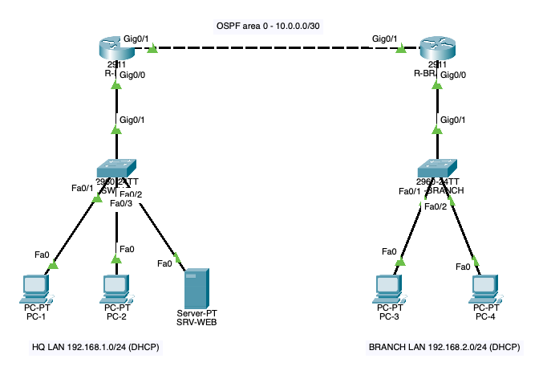

<p align="center">
  <picture>
    <source media="(prefers-color-scheme: dark)" srcset="docs/assets/logo-dark.svg">
    
  </picture>
</p>

<p align="center">
  <strong>The MCP server that puts Cisco Packet Tracer under your AI agent's control.</strong>
</p>

<p align="center">
  <a href="LICENSE"></a>
  
  
</p>

---

## Introduction

pktctl lets an AI agent build, configure and test networks in Cisco Packet
Tracer the way a person would, but through a programmatic interface instead of
the mouse. You describe the network you want; the agent places the devices,
cables them, types the IOS configuration at each console, runs `ping` from the
end hosts and reads the results back, all inside the Packet Tracer window you
already have open.

It is a server for the [Model Context Protocol](https://modelcontextprotocol.io)
(MCP), the open standard that AI clients such as Claude Code, Claude Desktop
and Cursor use to call external tools. pktctl gives those clients 72 tools
that cover Packet Tracer's logical and physical workspaces, simulation mode,
end-device applications and activities, plus direct access to the complete
IPC API for anything else.

pktctl talks to Packet Tracer through **PTMP**, the native protocol Packet
Tracer offers to registered external applications. That choice shapes how it
behaves:

- **Nothing to keep open inside Packet Tracer.** There is no extension window
  and no polling bridge between the agent and the simulator; a single
  registration is enough.
- **Fast and precise.** Calls round-trip in well under a millisecond, and
  `call_ipc` checks every argument against the official API before sending it.
- **Readable failures.** Errors come back as typed messages the agent can act
  on (`Device: IPC Cache entry`), never as a modal dialog that freezes the
  application.
- **One static binary.** No runtime, interpreter or package manager is needed
  to run it.

pktctl is useful to students practicing CCNA labs, to instructors preparing
and checking activities, and to anyone who wants to automate or document
network scenarios in Packet Tracer.

### An example

Asked for two sites joined by OSPF, with DHCP on each LAN and a web server at
headquarters, an agent using pktctl placed and cabled the routers, switches and
hosts, configured both routers, requested the DHCP leases and checked the
result: OSPF adjacency in `FULL` state, the remote LAN in the routing table,
and ping and traceroute from the branch to headquarters.

<p align="center">
  
</p>

## Contents

- [Requirements](#requirements)
- [Installation](#installation)
- [What you can do](#what-you-can-do)
- [How it works](#how-it-works)
- [Configuration](#configuration)
- [Troubleshooting](#troubleshooting)
- [Documentation](#documentation)
- [Contributing](#contributing)
- [License](#license)

## Requirements

| Requirement | Notes |
|---|---|
| Cisco Packet Tracer 9.0.1 | Available at no cost from [Cisco Networking Academy](https://www.netacad.com/cisco-packet-tracer). |
| Rust 1.88 or newer | Needed to build pktctl. Install it with [rustup](https://rustup.rs). |
| An MCP client | Claude Code, Claude Desktop, Cursor or any client that runs stdio MCP servers. |

pktctl builds on Linux, macOS and Windows. Every live validation so far ran on
macOS; the registration paths for the other systems are described in
[ExApp registration](docs/features/exapp-registration.md).

## Installation

Installation takes five steps. Only the fourth one happens inside Packet
Tracer, and it is done once.

### 1. Install the binary

```bash
cargo install --git https://github.com/TantiE100/pktctl pktctl --locked
```

Cargo builds pktctl and places it in `~/.cargo/bin/pktctl`
(`%USERPROFILE%\.cargo\bin\pktctl.exe` on Windows). Check it with
`pktctl --version`.

To build from a clone instead, run `make release` in the repository; the
binary is written to `target/release/pktctl`.

### 2. Choose an app id and a secret

Packet Tracer identifies external applications by an id and authenticates them
with a shared secret. Pick any reverse-domain id, such as `dev.pktctl`, and
generate a random secret:

```bash
openssl rand -hex 24
```

Keep the secret private: it grants full control of Packet Tracer.

### 3. Add pktctl to your MCP client

<details open>
<summary><strong>Claude Code</strong></summary>

```bash
claude mcp add pktctl --scope user \
  -e PKTCTL_APP_ID=dev.pktctl \
  -e PKTCTL_SECRET=your-random-secret \
  -- "$HOME/.cargo/bin/pktctl"
```

</details>

<details>
<summary><strong>Claude Desktop</strong></summary>

Edit `claude_desktop_config.json`
(`~/Library/Application Support/Claude/` on macOS,
`%APPDATA%\Claude\` on Windows) and restart Claude Desktop:

```json
{
  "mcpServers": {
    "pktctl": {
      "command": "/Users/you/.cargo/bin/pktctl",
      "env": {
        "PKTCTL_APP_ID": "dev.pktctl",
        "PKTCTL_SECRET": "your-random-secret"
      }
    }
  }
}
```

</details>

<details>
<summary><strong>Cursor and other clients</strong></summary>

Most clients accept the same `mcpServers` block shown for Claude Desktop; in
Cursor it goes in `~/.cursor/mcp.json`. Use the absolute path to the binary,
because clients do not always inherit your shell's `PATH`.

</details>

### 4. Register pktctl in Packet Tracer

1. Ask the agent: *"Run setup_exapp."* pktctl writes
   the registration file `~/.config/pktctl/pktctl.pta`.
2. In Packet Tracer, open **Extensions → IPC → Configure Apps**, choose
   **Add**, select that file and confirm with **Ok**.
3. Quit Packet Tracer normally once (File → Exit). Packet Tracer only saves
   its list of registered apps when it closes cleanly.

The complete procedure, including a manual alternative, is in
[ExApp registration](docs/features/exapp-registration.md).

### 5. Verify the connection

Ask the agent: *"Check the pktctl status."* A reply with `connected: true`,
the Packet Tracer version and the device count means everything works. If
not, the reply explains what to fix; see [Troubleshooting](#troubleshooting).

## What you can do

The tools are grouped by the job they do. A few example requests for each
group:

| Area | What pktctl handles | Try asking |
|---|---|---|
| Topology | Adding, renaming, moving and cabling devices, installing modules, notes and drawings on the canvas | *"Add a 2911 router and two 2960 switches and cable them."* |
| IOS | Running any command at a router or switch console and applying configuration blocks, with confirmations answered | *"Configure OSPF area 0 on both routers and show the neighbors."* |
| End devices | IPv4 and IPv6 addressing, DHCP, firewalls, Command Prompt, web browser, email, VPN and files | *"Give the PCs addresses by DHCP and ping the server from each one."* |
| Servers | DHCP pools, DNS records, web pages, FTP and email accounts | *"Publish intranet.lab.local on the server and browse to it from PC1."* |
| Simulation | Simulation mode, PDUs, stepping and the per-hop event list with Packet Tracer's explanations | *"Send a ping from PC1 to PC4 in simulation and explain each hop."* |
| Physical workspace | Cities, buildings, closets, racks and where each device sits | *"Put the switches in a rack in the wiring closet."* |
| Wireless | Access point security and client association | *"Secure the access point with WPA2 and connect the laptops."* |
| Activities | `.pka` instructions, progress, score and connectivity checks | *"How much of this activity is complete, and what is missing?"* |
| Everything else | The full IPC API: 346 classes and 3111 methods, searchable and callable | *"Find the IPC method that reads the ARP table of R1."* |

The complete list of the 72 tools is in [docs/tools.md](docs/tools.md), and
[docs/coverage.md](docs/coverage.md) records how each area was validated.

## How it works

```
AI client  ──MCP over stdio──▶  pktctl  ──PTMP over TCP 39000──▶  Packet Tracer
```

The MCP client starts pktctl as a child process. pktctl authenticates to
Packet Tracer as a registered external application and translates each tool
call into one or more IPC calls. When a tool needs something the IPC API does
not offer, such as buildings or furniture in the physical workspace, pktctl
edits the saved `.pkt` file and reopens it. The design is described in
[docs/architecture.md](docs/architecture.md) and the wire format in
[docs/reference/ptmp.md](docs/reference/ptmp.md).

## Configuration

pktctl reads its settings from environment variables:

| Variable | Required | Default | Purpose |
|---|---|---|---|
| `PKTCTL_APP_ID` | yes | | App id registered in Packet Tracer. |
| `PKTCTL_SECRET` | yes | | Shared secret registered in Packet Tracer. |
| `PKTCTL_ADDR` | no | ports 39000 to 39009 on this computer | Address of Packet Tracer's IPC listener. Without it, pktctl finds Packet Tracer on the first of those ports where it accepts the credentials; with it, pktctl uses that address only. |
| `PKTCTL_CALL_TIMEOUT_SECS` | no | `30` | Time limit for a single IPC call. |
| `PKTCTL_PT_HOME` | no | usual install folders | Packet Tracer installation, used by `setup_exapp`. |
| `PKTCTL_SETUP_DIR` | no | `~/.config/pktctl` | Where `setup_exapp` writes the registration file. |
| `PKTCTL_LOG` | no | `warn` | Log level, written to stderr. |

## Troubleshooting

| What `status` reports | Cause and fix |
|---|---|
| `Packet Tracer is not reachable` | Packet Tracer is closed, or it listens outside ports 39000 to 39009. When 39000 is still taken, for example right after a crash, Packet Tracer moves to 39001; pktctl follows it on its own, and `status` shows the port in `addr`. For any other port, check **Extensions → IPC → Options** and set `PKTCTL_ADDR`. |
| `rejected app id ...` | pktctl is not registered, or `PKTCTL_SECRET` differs from the registered key. Run `setup_exapp`, register the new file and quit Packet Tracer normally once. |
| `does not have the necessary privilege` | pktctl was registered with an older template. Register the file `setup_exapp` creates again. |

## Documentation

The [docs/](docs/README.md) folder holds the architecture, the feature
references, the PTMP wire reference and the development guide. Releases are
listed in [CHANGELOG.md](CHANGELOG.md).

## Contributing

Issues and pull requests are welcome. [docs/development.md](docs/development.md)
covers the commands, the test layers, the live test suite against a running
Packet Tracer and the branch workflow. `make check` runs the same formatting,
lint and test steps as CI.

## License

pktctl is released under the [MIT License](LICENSE).

Cisco, Packet Tracer and Cisco IOS are trademarks of Cisco Systems, Inc. This
project is an independent client and is neither affiliated with nor endorsed
by Cisco. It ships no Packet Tracer code, files or documentation: you need
your own installation of Packet Tracer for it to talk to anything.
